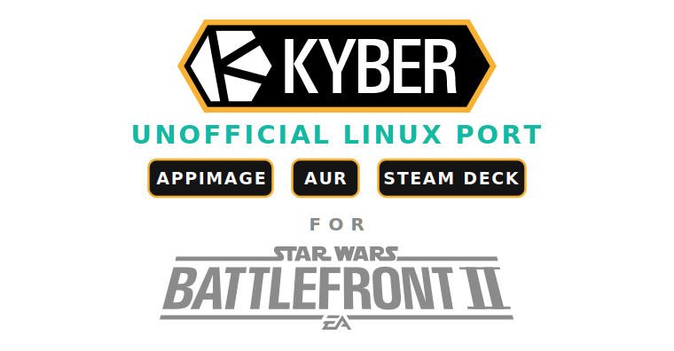

<h1 align="center">
  
</h1>

Unofficial Linux build of the [Kyber](https://kyber.gg) mod launcher for
Star Wars: Battlefront II (2017). The upstream launcher is Windows only,
so this just packages the existing source from
[ArmchairDevelopers/Kyber](https://github.com/ArmchairDevelopers/Kyber)
and [ArmchairDevelopers/Maxima](https://github.com/ArmchairDevelopers/Maxima)
into an AppImage that runs on Linux.

This is a community fork. Not endorsed by the Kyber team, ArmchairDevelopers,
EA, Lucasfilm, or Disney. If you're on Windows, use the
[official launcher](https://kyber.gg). Bugs in this Linux build go here,
not to upstream Kyber.

## Latest release

The latest build is
[v0.1.0-beta.6.4.8](https://github.com/simonlinuxcraft/kyber-linuxport-unofficial/releases/tag/v0.1.0-beta.6.4.8)
from 2026-06-25.

v0.1.0-beta.6.4.8 hardens game launch. On the Steam Deck the launcher no longer
hangs forever when a Wine helper call stalls (calls are now bounded, with a
generous default so a first-run runtime download is not cut off), and the
post-launch grace window is raised so a slow Deck is not refocused over the
still-loading game. On systems older than glibc 2.38 it now shows a dialog and
exits cleanly instead of crashing windowless. Starting or joining a game with a
missing game directory (a moved custom path or an unmounted drive) now reports a
clear error instead of crashing the launcher.

v0.1.0-beta.6.4.7 fixed a first-start crash on the intro video for fresh installs
on systems that have a system libmpv installed. The bundled libmpv is pinned so
the host copy is never loaded, and the intro video is kept on all distributions.

It carries everything from 6.4.6: an in-app Native Wayland toggle (Settings ->
Mods / Proton / Wayland); X11 stays the default, the toggle only shows on a
Wayland session and applies after a restart. From 6.4.5 it brings a batch of
upstream launcher fixes and the AppImage startup and slimming fixes. Mods packed
inside a subfolder of a download now install, a single unreachable proxy no
longer empties the proxy list, corrupted collections show a warning and a working
copy is preferred when joining, the server browser search clears on tab switch,
and the window can be dragged by the full title bar. It also fixes a possible
startup crash on minimal systems without a system librsvg.

It carries the Steam Deck launch work from 6.4.4: the pre-launch registry setup
is skipped when the prefix files already carry the needed values (a Deck tester
saw that setup stall for over an hour), and the first launch reuses the Steam
Linux Runtime that Steam already ships on the Deck instead of having umu download
its own copy. On rolling Arch and CachyOS it needs the nettle3 package, which the
launcher points out.

Older releases are listed in [`CHANGELOG.md`](CHANGELOG.md).

## Heads up

This is a beta and a one-person port, so expect rough edges. The inject
works on the common setups now, but voice chat is not fully proven yet,
Nexus mod downloads can still fail, and some distro or GPU combinations
do not work at all (a VM without GPU passthrough will not run BF2, for
example).

It also assumes a healthy system underneath. A working Steam-Proton or
Lutris install of BF2, a real GPU with proper Vulkan drivers, and a
normal desktop audio stack. The launcher cannot fix a broken Proton
prefix or missing graphics drivers. A well set up system is the
baseline here, not something the AppImage brings along.

## Dependencies

The AppImage bundles most of its libraries but still needs the system
GTK stack plus FUSE. A missing one of these is the most common reason a
fresh install misbehaves, so pull them in up front.

Debian, Ubuntu, Mint:

```bash
sudo apt install libgtk-3-0 libfuse2 librsvg2-2 libnotify4 gstreamer1.0-plugins-bad gstreamer1.0-plugins-ugly gstreamer1.0-libav zenity gamemode
```

Arch, CachyOS:

```bash
sudo pacman -S --needed gtk3 fuse2 librsvg libnotify gst-plugins-bad gst-plugins-ugly gst-libav zenity gamemode nettle3
```

Fedora: the equivalent gtk3, fuse, librsvg2, libnotify and gstreamer1
plugin packages.

gtk3, librsvg, libnotify and fuse are required, the app will not start
cleanly without them. (webkit2gtk is no longer needed: the in-app
webview is unused on Linux, so it was dropped to fix startup on systems
without a system webkit such as the Steam Deck.) The gstreamer plugins
make the EA login splash video play (silent without them, not fatal).
zenity drives the first-start dialog. gamemode is optional but recommended,
it keeps the CPU governor on performance for smoother frames. libmpv
is bundled inside the AppImage, you do not install it yourself. nettle3 is
only needed on rolling Arch/CachyOS, which now ships nettle 4.0 (libnettle.so.9);
without the libnettle.so.8 it provides the launcher will not start, and it
shows a dialog telling you so.

## Install

You need BF2 already installed via Steam-Proton (or Lutris). The launcher
doesn't bootstrap Wine itself.

```bash
mkdir -p ~/Applications
mv ~/Downloads/KyberLinuxPort-x86_64.AppImage ~/Applications/
chmod +x ~/Applications/KyberLinuxPort-x86_64.AppImage
~/Applications/KyberLinuxPort-x86_64.AppImage
```

On first start a small zenity dialog asks if you want a desktop entry.
Say yes if you want the launcher in your app menu. Most distros have
zenity preinstalled. If the dialog doesn't show up, install it via your
package manager.

Tested on Ubuntu 24.04 with an Nvidia RTX 3060. Other distros should work
since the AppImage bundles its own runtime, but I haven't verified every
one personally. The build needs glibc 2.38 or newer, so older releases
(Ubuntu 22.04, Debian 12, SteamOS 3.6) cannot run it; use 24.04+, Fedora,
SteamOS 3.7+ or Bazzite.

On Arch or CachyOS you can install from the AUR instead:

```bash
yay -S kyber-launcher-unofficial-appimage   # or: paru -S kyber-launcher-unofficial-appimage
```

The AUR package is a native binary build (contributed by Yilmaz4), not the
AppImage, and pulls in its own dependencies. The manual pacman step above is
only needed if you run the downloaded AppImage directly. The package keeps the
`-appimage` name for now and will be renamed to `kyber-launcher-bin` at beta 10.

## Steam Deck / SteamOS

Use Desktop Mode. The AppImage runs on SteamOS like on any other distro;
the webkit dependency was dropped, so it starts without extra packages.

The catch is the EA login. The launcher opens EA sign-in in your browser,
and on the Deck that is usually a Flatpak browser, which does not hand the
`qrc://` callback back to the launcher, so the automatic login never
completes. To finish login manually:

1. Press "Login with EA" and sign in in the browser that opens.
2. After signing in, the browser tries to open a `qrc://...` link and
   shows an error or blank page. Copy that link (or just the `code=...`
   value from it).
3. Back in the launcher, paste it into the field under "Browser did not
   return to the launcher?" on the login screen and submit.

On a detected Steam Deck that paste field is shown expanded by default.

Alternative: run the launcher inside a Distrobox container that has a
normal (non-Flatpak) browser, where the callback can work automatically.

## Advanced (optional)

### Custom Proton path

The default flow downloads a known-good GE-Proton into
`~/.local/share/maxima/wine/proton/` and runs BF2 from there. That is the
only tested-stable path and the recommended default for most users.

Advanced users can override the Proton build used for BF2. Settings ->
Mod Configuration -> "Custom Proton Path (Experimental)" opens a dialog
that browses for or scans the standard Steam compatibility-tools folders.
Verified to work in testing: GE-Proton 10.x family, Proton-EM Latest,
proton-cachyos 11.x. Newer builds with Wine 10 + DXVK 2.x can give
noticeably smoother frame times than the bundled default, at the cost of
losing the tested-stable safety net.

Equivalent power-user env var:

```bash
KYBER_PROTON_PATH="$HOME/.steam/steam/compatibilitytools.d/Proton-EM Latest" \
  ~/Applications/KyberLinuxPort-x86_64.AppImage
```

Resolution order is env var first, then a sidecar file at
`~/.local/share/maxima/custom_proton_path` (written by the UI), then the
auto-managed default.

Implementation: when a custom path is active, the launcher transparently
swaps `~/.local/share/maxima/wine/proton` for a symlink to the chosen
build (originals are moved aside to `proton.maxima-backup`). The Wine
prefix itself stays the shared BF2 Steam compat-prefix, so save games and
EA App login survive switching between default and custom. "Reset to
default" in the dialog restores the symlink instantly without re-download.

Switching Proton also clears BF2's vkd3d-proton.cache automatically, so
the first match after a switch will recompile shaders for one or two
minutes and then settle smooth. A manual Clear shader cache button is
in the dialog for cases where the auto-purge cannot find your BF2
install (Custom Game Path setups).

Close BF2 fully before switching Proton. The dialog detects a stale
wineserver from a previous BF2 session and offers a one-click "Kill
wineserver and retry" action, but cleanly exited beats forced-kill.

### Native Wayland

The launcher runs on X11 (XWayland) by default, which is the stable path. On a
Wayland session you can switch to the native backend under Settings -> Mods /
Proton / Wayland ("Native Wayland", experimental). It applies after a restart.
The toggle only appears on a Wayland session; on X11 there is no Wayland display
to use, so it is hidden.

If the native backend glitches or crashes, turn the toggle back off (or remove
`~/.config/kyber-linuxport/backend`) and it falls back to X11. The manual
override still works too:

```bash
GDK_BACKEND=wayland ~/Applications/KyberLinuxPort-x86_64.AppImage
```

## Build

Flutter (master channel), Rust stable, GTK 3 dev packages, patchelf,
librsvg dev tooling.

```bash
git clone --recurse-submodules https://github.com/simonlinuxcraft/kyber-linuxport-unofficial.git
cd kyber-linuxport-unofficial/Kyber/Launcher
flutter build linux --release
cd ../..
tools/build-appimage.sh
```

Output ends up in `tools/KyberLinuxPort-x86_64.AppImage`. First build
takes a few minutes (cargo fetch, Rust compile, Flutter bundle).
Subsequent builds are usually around 30 seconds. AppImage packaging
itself adds about a minute.

## License

GPLv3, see [`LICENSE`](LICENSE). This is a derivative work of the
upstream Kyber and Maxima codebases, both GPLv3. Linux-port changes are
GPLv3-only.

For binary distributions, the corresponding source is this repo at the
release tag. The AppImage embeds a `source-url.txt` pointing back here.
The bundled `wine-helper.exe` from ACowAdonis has its own source offer
in `Kyber/CLI/cli_payload/README.md`.

See [`NOTICE.md`](NOTICE.md) for the full list of third-party components
shipped in the AppImage.

## Contributing

Small one-person project. If you hit a Linux-specific bug, open an issue
here. Don't report Linux-specific bugs to the upstream Kyber team, they
didn't write this part. If you're not sure whether something is
Linux-specific, file it here anyway and I'll redirect if it turns out to
be upstream.
